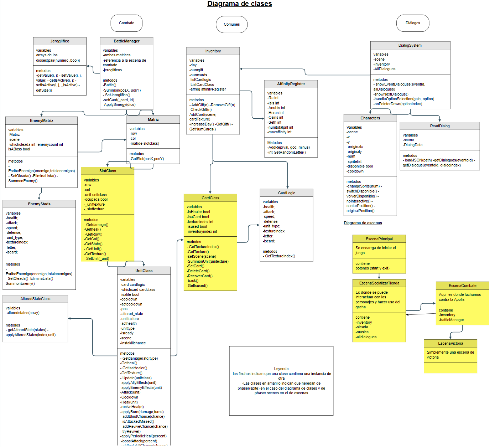

Chamber of the Heart es un videojuego desarrollado por ISOS para la asignatura de Programación de videojuegos en lenguajes interpretados con un objetivo didáctico y educativo.

**SINOPSIS**:  
Shai ha custodiado un templo dedicado a Ra toda su vida y ahora se enfrenta a la mayor amenaza contra su dios, La Serpiente Apofis.  
La serpiente ha empezado a atacar numerosas regiones egipcias por la noche, y cada vez está más cerca.  
Con la ayuda de guerreros dispuestos a unirse a su causa y refugiados que ahora viven en el templo, Shai deberá plantar cara a Apofis cada noche hasta que su hogar vuelva a estar a salvo.

**DESARROLLADORES**:

- Asher Carrero  
- David Fernández  
- David Benito  
- Iker Martínez

**REDES**:

- Twitter: [https://x.com/isocatinabox](https://x.com/isocatinabox)  
- Web de GitHub: https://reycka.github.io/ISOS/

IMÁGENES DEL PROYECTO

Shai, el protagonista en su templo dando la bienvenida.

Khayyat nuestro gato gacha ansioso de recibir tus ofrendas a cambio de cartas.  

Organizando al ejército para defender el templo de las fuerzas de Apofis  

**ASSETS**
Al tratarse  de un juego ambientado en Egipto se ha buscado una estética que se encuentre acorde al mismo, con un templo basado en los de los dioses y con personajes que toman mucho de atuendos egipcios clásicos con joyería y maquillaje  de la misma tal y como lleva nuestro protagonista.

Todas las imágenes han sido creadas a mano por nuestros artistas Asher Carrero e Iker Martínez y su uso queda restringido bajo derechos de autor. 
Tanto los ejectos de sonido como música pueden encontrarse en https://ovanisound.com.

**architecture**

UML.

Cantidad de escenas = entre 4
-menú inicial
-créditos
-lobby
-oleadas(misma escena para todas)

7.2.2 InventoryClass
 Se encarga de la gestión del número de cartas y las ofrendas.
Propiedades:
-int ofrendas 
	-Lista de Cards
Funciones:
	-Constructora(): no recibe parámetros.

-InsertCard(Card c) inserta una carta nueva en lista.

-MoveList(bool izq); mueve las cartas en pantalla para mostrar las cartas faltantes. Si el booleano es true se mueve hacia la izquierda y false hacia la derecha esto dado por las flechitas en la pantalla.

-PutCard(int i) muestra la carta de ese índice en pantalla(la instancia en el mazo).

7.3 CLASES DE SOCIALIZAR

7.3.1 Diálogos

7.3.1.1 Character
Esta clase contiene la id del personaje, un booleano con su disponibilidad, sus sprites, su 
posición y en qué conversación está. De aquí se sacará la información para llamar a la clase
	DialogSystem y se cambiará el aspecto del personaje cuando sea necesario.

	7.3.1.2 DialogSystem
	Se encarga de escribir en pantalla los diálogos, las opciones en caso de que las haya y manejar las decisiones del jugador.
(Hay que pasarle el inventario para que pueda sumar ofrendas y 
reputación, También todos 	los diálogos disponibles y la id de cuál tiene que leer) 	

7.3.1.3 ReadDialog
Clase que recibe el archivo .json con todo los eventos, lo lee y carga el evento 
correspondiente  para que se pueda mostrar en pantalla en el DialogSystem.

7.3.2 AfinityRegister
Esta clase guarda la afinidad respectiva a cada dios, sus métodos son simplemente add, remove y get de los valores de la lista de dioses.

Propiedades

Enum dioses(para pasarlo como valores del array si js quiere)

Array(ints) de la afinidad de los dioses.

7.4 CLASES DE COMBATE

7.4.1 BattleManager
Se encarga de toda la gestión de combate, contiene la matriz y tiene acceso a todas las tropas colocadas,
 controla la victoria y derrota(el paso de escenas per se está en el Game Manager que gestiona las escenas). Es un singleton.

Propiedades.

	-Matriz de Casillas (SlotClass)

	-acceso al GameManager

	-InventoryClass

	-Lista de Wave Class

	-enum sinergias

	-Lista de sinergias activas

    -Lista de letras actuales 

Funciones

	-Constructora(inventory Class inv,int actual wave) simplemente le pasamos el inventario que vamos a utilizar.

	-SeatWave(int) Coloca los enemigos de ese índice de la lista en la matriz enemiga.

	-CheckVD() comprueba si quedan enemigos o aliados para ver si el combate ha terminado.

	-ApplySin(enum sinergia) aplica la sinergia correspondiente.

	-CheckSin() si se ha activado una sinergia se mete esta en la lista de sinergias activas. Esto se comprueba cada vez que se coloca una carta.

	-NearEnemy(posx) esta función devuelve la posición enemiga más cercana a la que la unidad que la pide.

7.4.2 Matriz
Esta clase corresponde a la matriz donde se podrán situar las unidades del jugador.

Propiedades:

SlotClass(por cada casilla), esto llevará la lógica de las casillas
nº de filas y columnas

Funciones:

Constructora(),crea la matriz en función de las filas y columnas

GetPos() devuelve la posición de la casilla

7.4.3 SlotClass

Esta clase es la que formará las casillas de la matriz del Battle Manager. Esto para evitar tener dos matrices gemelas con las que trabajar en simultáneo.

Propiedades
	
    -UnitClass
	
    -Bool ocupada

Funciones

	-SetUnit(UnitClass unit) coloca la unidad en la casilla y pone el booleano ocupada en true.

	-GetState() devuelve si está ocupada.

	-SetFree() si la unidad ha sido derrotada o se ha movido cambia su valor de ocupada a false.

	-SetFull() si una unidad se ha movido a esta casilla esta cambia su ocupada a true.

7.4.4 EnemyMatriz

Simplemente contendrá la información necesaria para que el BattleManager pueda 
situar los enemigos en la matriz, es una extensión de la clase matriz.

Propiedades

	-EnemyStads(Script que setea las stats a los enemigos)

	-oleada, referencia al archivo txt que controla las unidades en dicha oleada

Funciones

	-Constructora(): crea la nueva matriz y setea los enemigos sin renderizarlos.

7.4.5 UnitClass

Las unidades aliadas y enemigas son la misma clase 

Propiedades:
	
    -vida
	
    -ataque
	
    -velocidad de ataque
	
    -defensa
	
    -Tipo_unidad : enum
	
    -Altered_State : clase propia
	
    -bool : IsaCart
	
    -bool: IsaHealer
	
    -Carta :clase propia
	
    -Sprite2D
	
    -Posición matriz(x,y): vector
	
    -actCooldown

Funciones:
	-SetStads(): si es una carta setea las stads de la carta a la unidad y su sprite

	-Attack(Unit interface enemigo): ataca al enemigo que se le pasa llamando al GetDamage() de este si el cooldown() devuelve true.

-Cooldown(): es un contador que devuelve true si es 0 y lo vuelve a poner a su valor
 original velocidad de ataque  y en caso contrario reduce el actcooldown en un segundo.

-Heal(): En caso de que la unidad sea un healer (IsaHealer == true) en vez de atacar curara a los aliados de su línea.
 si está en la posición (1,1) curará a la unidad de la posición (1,2). Sigue requiriendo del metodo Cooldown para llamarse.

-GetDamage(int daño, tipo_unidad t) el metodología ejecuta la siguiente fórmula
				vida-= (dañodefensa*multi) +1
Multi es una variable que se asigna previamente en el método para ver si la unidad es débil al tipo atacante. 
Tras recibir el daño comprueba si vida<=0 y en caso de serlo llama al método Death()
	
    -Death(): destruye la unidad liberando la casilla en la que estaba

	-CompruebaEnem() esta función devuelve una posición (x,y) de donde se encuentra el enemigo situado
     en frente de la unidad. en caso de no haber nada devuelve valores inválidos (ej: -1,-1).

	-MueveUnidad(): En caso de no haber enemigo en frente de la unidad llama al método NearEnemy(pos unidad )
    del BattleManager para recibir la posición del enemigo más cercano y en caso de que la casilla está vacía mover a la unidad a dicho espacio.

-Update(): montar la lógica de la ia con los métodos anteriores.

-Constructora([stads],pos,IsaCard,,[Isahealer],Sprite,[Carta]): la constructora se encarga de asignar los valores 
al instanciar la unidad en la matriz. Los parámetros entre[] significa que son opcionales(ya que si es un enemigo 
se los debemos pasar y si es una carta no es necesario). En caso de ser una carta se leerán los valores de sus stands 
y se asignan a la instancia de la unidad. El caso del Sprite es especial ya que la carta debería tener ese dato y
 pasarlo y al enemigo hay que pasarselo obligatoriamente.

7.4.6 CardClass

Esta clase contiene los parámetros de las unidades junto a su sprite, el de la propia carta y la letra.

Propiedades:
    -vida

	-ataque

	-velocidad de ataque

	-defensa

	-Tipo_unidad : enum

-bool: IsaHealer

-SpriteCarta

-SpriteUnit

-Letra (clase o enum) 

Funciones:

	-Constructora(Stads(lo dicho arriba));

	-SummonCart(pos): coloca la unidad de la carta en la matriz elegida a través del BattleManager. 

-SetCard(int i??) damos el índice por el input y devolvemos la carta seleccionada(al BattleManager).	

7.4.7 AlteredState

 Esta clase estará dentro de las unidades y se gestionará sus llamadas a su efecto en los updates de las unidades.

Propiedades:

	-TipoEstado enum

	-Cooldown

Funciones:

	-Constructora(enum Tipo, [int cooldown]) El cooldown es un parámetro opcional para los efectos que lo necesiten.

	-ApplyState(UnitClass unit) aplica el estado alterado a la tropa.
    
	-ActiveEffect() ejecuta el tipo de estado alterado correspondientes.

